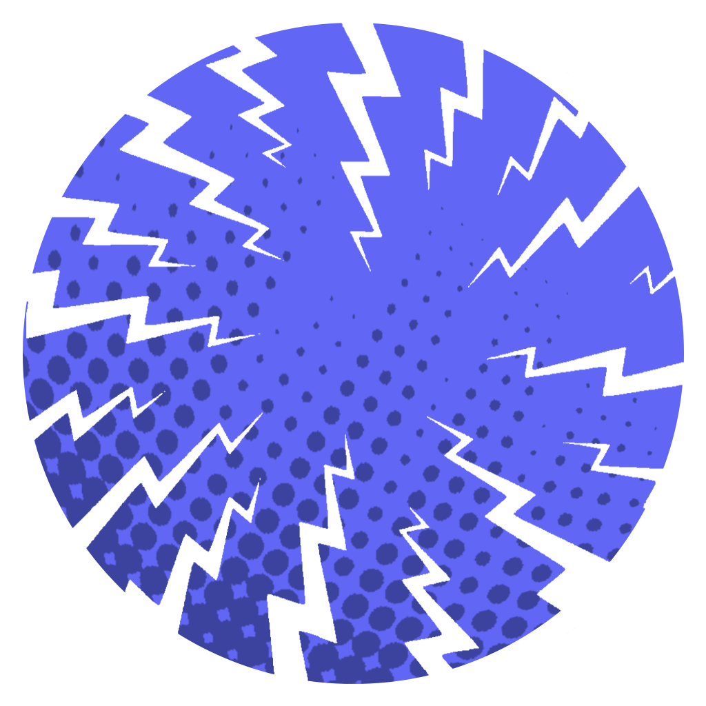

<p align="center">
    
</p>

# CastLab client

CastLab client for the castlab protocol

## How to use

- In the project folder: 
  ```bash
  # install dependencies
  pnpm install # npm install

  # run in developer mode
  pnpm dev # npm run dev

  # build
  pnpm build # npm run build
  ```

## Note for PNPM

In order to use with `pnpm`, you'll need to adjust your `.npmrc` to use any one the following approaches in order for your dependencies to be bundled correctly (ref: [#6389](https://github.com/electron-userland/electron-builder/issues/6289#issuecomment-1042620422)):
```
node-linker=hoisted
```
```
public-hoist-pattern=*
```
```
shamefully-hoist=true
```
